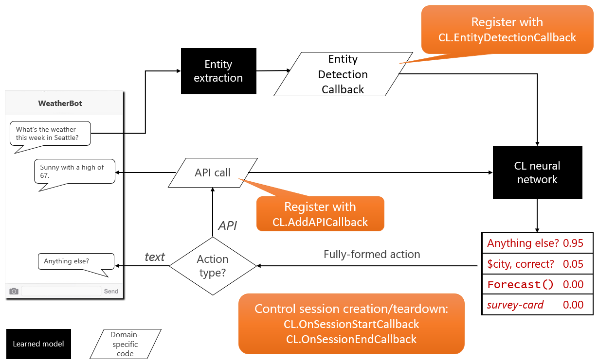

## Control flow

This document describes the control flow of the Conversation Learner (CL) as displayed in the below diagram.

1. User enters a term or phrase in the bot, for example, 'what is the weather this week in Seattle?'
1. CL calls LUIS for entity extraction and provides the user input. 
2. The result of the call is handled by the Entity Detection Callback method in the bot's code.
1. CL neural network then takes the output of the entity extraction and the user input, and predicts the next set of possible actions as a probability distribution. Here, the highest probability action is to provide the weather forecast.

5. The selected action, in this case, requires an API call to retrieve the weather forecast. 
6. The result of the API call is returned to the registered API Callback method in the bot. And presented to the user, for example, 'Sunny with a high of 67.'
7. The call is then made to the neural network to determine the next action based on the previous step.
8. The neural network then predicts the next set of possible actions, and the selected action is presented to the user, in this case, 'Anything else.'