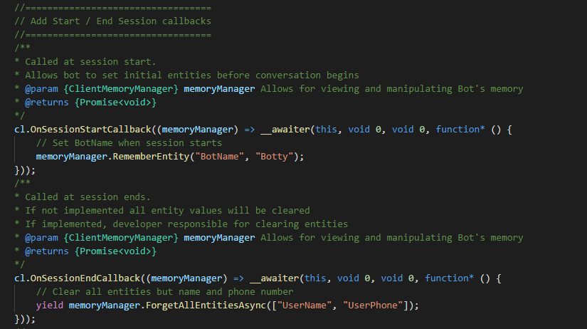

# Tutorial 11: Session callbacks
This tutorial illustrates the onSessionStart and onSessionEnd callbacks.

## Requirements
This tutorial requires that the "tutorialSessionCallbacks.ts" bot is running.

	npm run tutorial-session-callbacks

## Details
This tutorial covers session, how sessions are handled by default, and how you can override that behavior.

A session is one conversation with the bot. It can have multiple turns, but there are no long breaks (30 minutes or longer) in the conversation.

If there are long breaks, then the bot will go to its next session. This means all entities will be cleared. And the RNN is put to its new state. 

The RNN will always go to its initial state in a new session, but in this demo we will see how to override the default entity handling behavior.

### Open the demo

In the App list, click on Tutorial-11-SessionCallbacks. 

### Entities

We have defined four entities in the application.

One thing to note is that BotName is a Programmatic Entity. And will be set by the bot at session start time.

### Actions

We have created four actions. 

What the demo will show is that you can get control of and set the Programmatic Entity on session start before user can say anything. This will allow you to manipulate entities and set the BotName entity.

Then you will see how you can persist name and phone number across sessions so they are not cleared. And clear user location. The idea being that each time the user talks to the bot, their location changes, but their name and phone number stays the same.

### Train Dialog

Here is an example dialog. This is one session.

This is not showing long breaks. We will see that later.

### Code for the callbacks

The code for the callback methods is in the this file: 
c:\<installedpath>\src\demos\tutorialSessionCallbacks.ts.

Both of these methods are optional.

- OnSessionStartCallback: this method sets the BotName entity.
- OnSessionEndCallback: you can specify what you want to clear. This will clear all entities except user name and user phone.

### Try the bot

Switch to the Web UI, and click on Log Dialogs.

1. Enter 'hello'.
2. System: 'Hi, I'm Botty. What's your name?' which has the name Botty coming from the OnSessionStartCallback.
3. Entery 'jason'.
4. System: 'Hi jason. What's your phone number?'
5. Enter '555-555-5555'.
6. System: 'Can you tell Botty your location, jason?'
7. Type 'redmond'.

This is one session. To start a new session, we need to end this session. 

1. Click Session Timeout. This will move you to the next session.
1. Enter 'hi'.
2. System: 'Can you tell Botty your location, jason?'
	1. The system has remembered the name and phone number.
2. Enter a new location: 'seattle'.
3. System: 'So, jason you are in seattle'.
4. Click Done Testing.

Let's switch back to Log Dialogs. Note that the last conversation has split into two because each log dialog corresponds to one session.  

- In the first interaction, Botty is set, but name and phone number are not.
- The second interaction shows the name and phone number.

You have now seen how sessions are handled by default, and how you can override the default behavior. 
