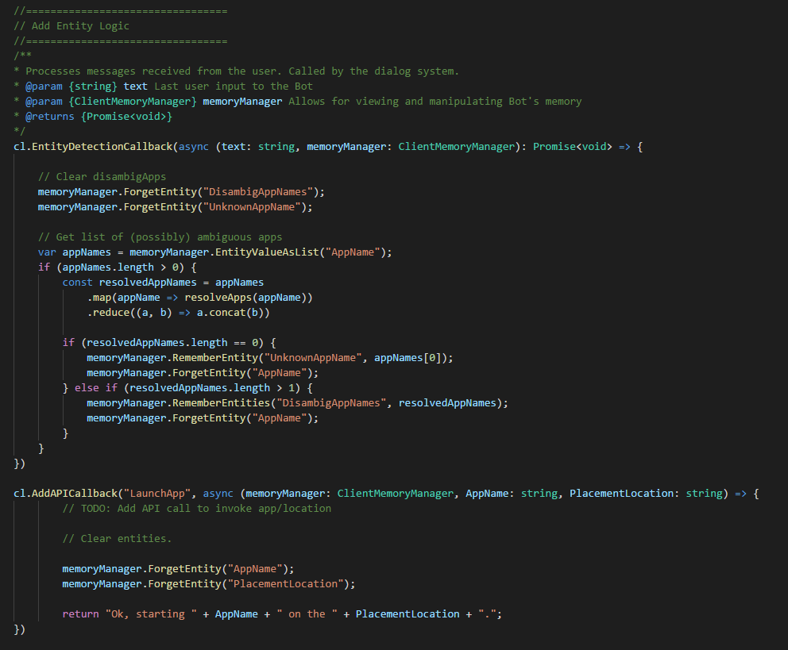

# Tutorial Demo: Virtual reality app launcher
This demo illustrates a virtual reality application launcher, supporting commands like "start skype and put in on the wall". A user needs to say an app name and location in order to launch the app. App launching is handled by an API call. When an app name is recognized from the user, the entityDetectionCallback checks whether the requested app matches one or more apps in the list of installed apps. It handles the case where the requested app is not installed, and where the app name is ambiguous (matches more than one installed app).

## Requirements
This tutorial requires that the VRAppLauncher bot is running

	npm run demo-vrapp

### Open the demo

In the App list of the web UI, click on VRAppLauncher. 

## Entities

We have created four entities:

- AppName: for example Skype
- PlacementLocation: for example wall
- UknownAppName: a programmatic entity which the system will set when it doesn't recognize an entity name the user says e.g. because it hasn't been installed.
- DisAmbigAppNames: an array of two or more installed app names which match what the user said. 

### Actions

We have created a set of actions which includes an API called LaunchApp which will start the function call to launch an app.

### Training Dialogs
We have defined a number of training dialogs.

As an example, let's try a teaching session.

1. Click Train Dialogs, then New Teach Session.
1. Enter 'hi'.
2. Click Score Action.
3. Click to Select 'which app do you want to start?'
4. Enter 'outlook'.
	1. Note that LUIS recognizes it as an entity.
5. Click Score Actions.
3. Click to Select 'where do you want it placed?'
4. Enter 'on the wall'.
	1. Note that LUIS recognizes it as a PlacementLocation.
2. Enter Score Actions.
6. Select 'LaunchApp'
7. System: 'starting outlook on the wall'.
	1. Note that this triggered an API call. The code for this call is at C:\<\installedpath>\src\demos\demoVRAppLauncher.ts. It does not actually have the logic to launch outlook for this demo however.
	2. It clears the AppName and PlacementLocation entities. The returns the above string as response.
4. Click Done Teaching.

Let's start another training session for handling unknown and ambiguous entities.

1. Click New Teach Session.
1. Enter 'start OneNote'. 
	1. It recognizes it as an app name because the EntityDetectionCallback defined in code takes the name user has entered, and resolves it to an app name by matching it to the app list defined in code. It then returns the set of all matching apps. 
	3. If the list of matches is zero, that means the app is not installed. It puts it in unknownAppName.
	4. If it finds more than one app, it will copy them into the DisambigAppNames and clear the AppName entity.
2. Click Score Action.
3. Click to Select 'Sorry, I don't know the app $UknownAppName.
4. Enter 'start amazon'. We'll try the other path.
5. Click Score Actions.
	1. Note amazon video and amazon music are now in DisambigAppNames memory. And onenote has been cleared.
3. Click to Select 'There are few apps that sound like that...'
	1. Note the score is not very high because we only have a few training dialogs up to this point. Looks like we would need some more here to make the model more decisive.
2. Enter Score Actions.
4. Click Done Teaching.

You have now seen how to do entity resolution. The demo also illustrated API callsbacks and showed a template for collecting information, checking for presence and ambiguity, and taking the right action based on that.
